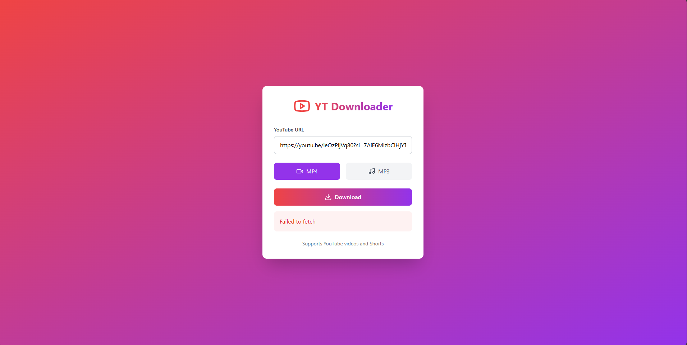

# YouTube Downloader

A modern, feature-rich YouTube video and audio downloader built with React, FastAPI, and Tailwind CSS.



## Features

- 🎥 Download YouTube videos in MP4 format
- 🎵 Extract audio in MP3 format
- ✂️ Video trimming support
- 📱 Responsive design for all devices
- 🌓 Dark/Light theme
- 📋 Download queue with progress tracking
- 📚 Download history
- 🎮 Intuitive user interface
- 🔒 Secure and rate-limited API
- 📦 Concurrent download handling
- 🎯 Quality selection (High/Medium/Low)
- 💾 Offline support with IndexedDB
- 📊 Real-time progress tracking
- 🔄 Auto-cleanup of old files

## Tech Stack

- **Frontend**
  - React 18
  - TypeScript
  - Tailwind CSS
  - Lucide Icons
  - IndexedDB (Dexie)
  - Vite

- **Backend**
  - FastAPI
  - Python 3.11+
  - yt-dlp
  - Loguru
  - Rate limiting
  - Security middleware

## Getting Started

### Prerequisites

- Node.js 18+
- Python 3.11+
- pip

### Installation

1. Clone the repository:
```bash
git clone https://github.com/SarangVehale/YankTube.git
cd YankTube
```

2. Install frontend dependencies:
```bash
npm install
```

3. Install backend dependencies:
```bash
cd backend

python3 -m venv virtual-env

# For Linux/ MacOS 
source virtual-env/bin/activate
# For Windows
virtual-env/Scripts/activate
pip install -r requirements.txt
```
4. Install ffmpeg

FFmpeg installation depends on your operating system. Here are instructions for Windows, macOS, and Linux:

---

**Windows**
1. **Download FFmpeg**  
   - Go to the official website: [https://ffmpeg.org/download.html](https://ffmpeg.org/download.html)  
   - Click **"Windows"**, then select **"Windows builds from gyan.dev"**.  
   - Download the latest **"full"** or **"essentials"** build.

2. **Extract the Files**  
   - Extract the downloaded `.7z` or `.zip` file using [7-Zip](https://www.7-zip.org/) or WinRAR.  
   - Move the extracted folder to a convenient location, e.g., `C:\ffmpeg`.

3. **Add FFmpeg to System Path**  
   - Open **Control Panel** → **System** → **Advanced system settings**.  
   - Click **Environment Variables**.  
   - Under **System Variables**, find `Path`, select it, and click **Edit**.  
   - Click **New**, then add `C:\ffmpeg\bin` (or the path where you extracted it).  
   - Click **OK** to save.

4. **Verify Installation**  
   - Open **Command Prompt** (`Win + R`, type `cmd`, press Enter).  
   - Type:  
     ```sh
     ffmpeg -version
     ```
   - If installed correctly, it will display version information.

---
**macOS (Using Homebrew)**
1. Open **Terminal**.
2. Install Homebrew (if not installed):
   ```sh
   /bin/bash -c "$(curl -fsSL https://raw.githubusercontent.com/Homebrew/install/HEAD/install.sh)"
   ```
3. Install FFmpeg:
   ```sh
   brew install ffmpeg
   ```
4. Verify installation:
   ```sh
   ffmpeg -version
   ```

---
**Linux (Ubuntu/Debian)**
1. Open **Terminal** and update packages:
   ```sh
   sudo apt update && sudo apt upgrade -y
   ```
2. Install FFmpeg:
   ```sh
   sudo apt install ffmpeg -y
   ```
3. Verify installation:
   ```sh
   ffmpeg -version
   ```

For other Linux distributions, use the respective package manager:
- Fedora: `sudo dnf install ffmpeg`
- Arch Linux: `sudo pacman -S ffmpeg`

---

### Development

1. Start the backend server:
```bash
cd backend
uvicorn main:app --reload
```

2. Start the frontend development server:
```bash
npm run dev
```

3. Open http://localhost:5173 in your browser

### Production Build

1. Build the frontend:
```bash
npm run build
```

2. Start the production server:
```bash
cd backend
uvicorn main:app
```

## Security Features

- Rate limiting
- File size restrictions
- URL validation
- Secure headers
- Input sanitization
- CORS protection

## Contributing

1. Fork the repository
2. Create your feature branch (`git checkout -b feature/amazing-feature`)
3. Commit your changes (`git commit -m 'Add some amazing feature'`)
4. Push to the branch (`git push origin feature/amazing-feature`)
5. Open a Pull Request

## License

This project is licensed under the MIT License - see the [LICENSE](LICENSE) file for details.

## Acknowledgments

- [yt-dlp](https://github.com/yt-dlp/yt-dlp) for the YouTube download functionality
- [FastAPI](https://fastapi.tiangolo.com/) for the backend framework
- [React](https://reactjs.org/) for the frontend framework
- [Tailwind CSS](https://tailwindcss.com/) for styling

